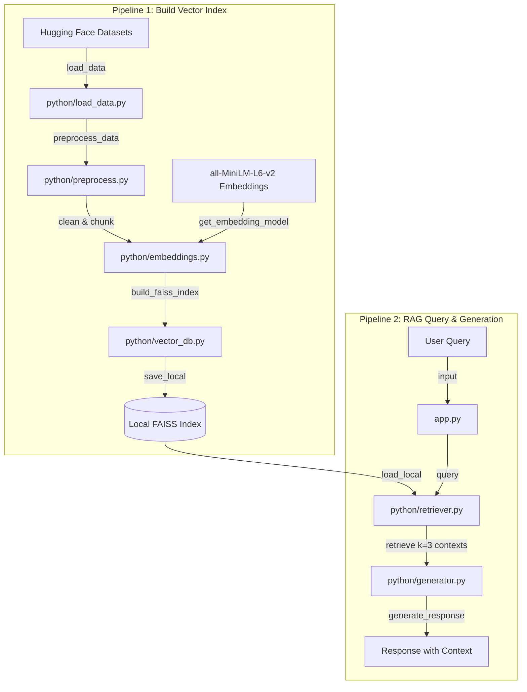

# BioASQ RAG (Retrieval-Augmented Generation) Pipeline

This project implements a complete **Retrieval-Augmented Generation (RAG)** pipeline designed for biomedical semantic question answering, based on the **BioASQ** dataset. The codebase is organized into two primary pipelines:

1. **Pipeline 1: Vector Index Building** — Loads raw corpus data, cleans and chunks passages, computes embeddings using a pre-trained model, and stores them in a local vector database.
2. **Pipeline 2: Chat Application** — Loads the vector database as a retriever, accepts user queries, retrieves relevant biomedical contexts, and generates a formatted response showing context integration.

---

## 🏗️ System Architecture

The following Mermaid diagram outlines the data flow across both pipelines:



---

## 📁 Repository Structure & File Workings

Below is a detailed breakdown of each file in this project, explaining its logic, core functions, and inputs/outputs.

### Root Orchestrators

#### 1. [build_index.py](file:///d:/RAG/build_index.py)
* **Purpose**: Coordinates **Pipeline 1** to process raw data and build the vector database.
* **Working**:
  1. Calls `load_data()` from [python/load_data.py](file:///d:/RAG/python/load_data.py) to fetch the dataset.
  2. Calls `preprocess_data()` from [python/preprocess.py](file:///d:/RAG/python/preprocess.py) to clean texts and split them into smaller, overlapping chunks.
  3. Loads the Sentence Transformers embedding model from [python/embeddings.py](file:///d:/RAG/python/embeddings.py).
  4. Passes chunks and the embedding model to `build_faiss_index()` from [python/vector_db.py](file:///d:/RAG/python/vector_db.py) to index documents and serialize the FAISS index to the local `vector_store/` directory.

#### 2. [app.py](file:///d:/RAG/app.py)
* **Purpose**: Coordinates **Pipeline 2**, serving as the interactive command-line interface (CLI) for user queries.
* **Working**:
  1. Checks if a built FAISS index exists in `vector_store/`. If not, prompts the user to build it.
  2. Loads the index as a retriever using `get_retriever()` from [python/retriever.py](file:///d:/RAG/python/retriever.py).
  3. Enters a loop to read input queries from the command line.
  4. Invokes the retriever to get the top 3 matching chunks for the query.
  5. Formats and displays metadata for retrieved chunks (Index, ID, text snippet).
  6. Calls `generate_response()` from [python/generator.py](file:///d:/RAG/python/generator.py) to show the final response.

---

### Source Code Module (`python/`)

#### 3. [python/load_data.py](file:///d:/RAG/python/load_data.py)
* **Core Function**: `load_data()`
* **Purpose**: Fetches the corpus data from Hugging Face.
* **Working**:
  - Uses the `datasets` library to load the `rag-datasets/rag-mini-bioasq` dataset, specifically using the `"text-corpus"` subset configuration.
  - Returns the `"passages"` split of the dataset, containing biomedical texts.
  - Can be run directly as a script to verify connection/schema download.

#### 4. [python/preprocess.py](file:///d:/RAG/python/preprocess.py)
* **Core Functions**:
  * `clean_text(text)`: Strips leading/trailing spaces and collapses internal consecutive whitespace and newlines.
  * `preprocess_data(corpus)`: Iterates through raw corpus rows, wraps cleaned text and its passage ID into LangChain `Document` objects, and chunks them.
* **Working**:
  - Splits documents using LangChain's `RecursiveCharacterTextSplitter` with a `chunk_size` of 384 characters and a `chunk_overlap` of 75 characters. This ensures semantically rich, manageable context sizes for the vector store.

#### 5. [python/embeddings.py](file:///d:/RAG/python/embeddings.py)
* **Core Function**: `get_embedding_model()`
* **Purpose**: Initializes and returns the dense vector embedding model.
* **Working**:
  - Utilizes `langchain_huggingface` to load the `sentence-transformers/all-MiniLM-L6-v2` model. This model converts raw text chunks into 384-dimensional dense vectors.
  - Includes a test harness block when run directly to embed a test sentence and display vector dimensions.

#### 6. [python/vector_db.py](file:///d:/RAG/python/vector_db.py)
* **Core Function**: `build_faiss_index(documents, embedding_model, store_path="vector_store")`
* **Purpose**: Creates the FAISS vector database index and saves it to disk.
* **Working**:
  - Leverages the `faiss-cpu` backend via LangChain's `FAISS` class.
  - Calls `FAISS.from_documents` to construct an in-memory index from document chunks and computed embeddings.
  - Saves the serialized index and mapping files to `vector_store/` using `save_local()`.

#### 7. [python/retriever.py](file:///d:/RAG/python/retriever.py)
* **Core Function**: `get_retriever(store_path="vector_store")`
* **Purpose**: Re-loads the vector database from disk and configures search parameters.
* **Working**:
  - Checks if the folder exists, initializes the embedding model, and loads the FAISS index using `FAISS.load_local`.
  - Enables `allow_dangerous_deserialization=True` since the FAISS pickle files are trusted local files.
  - Converts the index database into a retriever object set to fetch the top `k=3` most similar documents.

#### 8. [python/generator.py](file:///d:/RAG/python/generator.py)
* **Core Function**: `generate_response(query, retrieved_docs)`
* **Purpose**: Generates the final output response for a given user query and context documents.
* **Working**:
  - Joins the text from retrieved documents to construct the context section.
  - Formulates a system/user prompt combining the context and query.
  - Currently contains a **Mock Output** that displays the structured context layout and query. Developers can easily swap this placeholder with a real LLM integration (e.g. `langchain_openai` or `langchain_huggingface` Chat models).

#### 9. [python/evaluate.py](file:///d:/RAG/python/evaluate.py)
* **Core Function**: `evaluate_system()`
* **Purpose**: A skeleton/placeholder module for pipeline evaluation.
* **Working**:
  - Returns simulated scores for key RAG evaluation metrics: `faithfulness` (0.85), `answer_relevance` (0.90), and `context_recall` (0.88).
  - Designed as an extension point for validation frameworks like **Ragas** or **TruLens**.

---

## 🚀 Getting Started

### 📋 Prerequisites & Installation
Ensure you have Python 3.8+ installed. You can install all project requirements using `pip`.

```bash
pip install -r requirements.txt
```
*(Make sure libraries such as `langchain-community`, `langchain-huggingface`, `faiss-cpu`, `datasets`, and `transformers` are present in your environment)*

### 🛠️ Step 1: Build the Vector Index
Run the script to download the BioASQ corpus, preprocess it, and build the local FAISS database:

```bash
python build_index.py
```
After running, a new folder named `vector_store/` containing the serialized FAISS indices (`index.faiss` and `index.pkl`) will be created in your root directory.

### 💬 Step 2: Run the Chat Application
Start the interactive command-line interface to ask biomedical questions:

```bash
python app.py
```
You can type any query, e.g., *"What is BioASQ?"*, and the application will output the retrieved passages and show the structured generator response. Type `exit` or `quit` to end the session.
